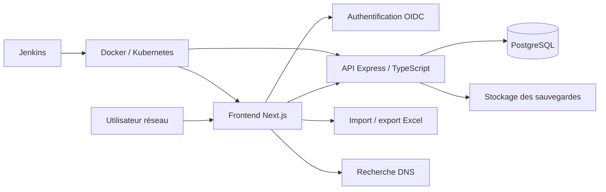
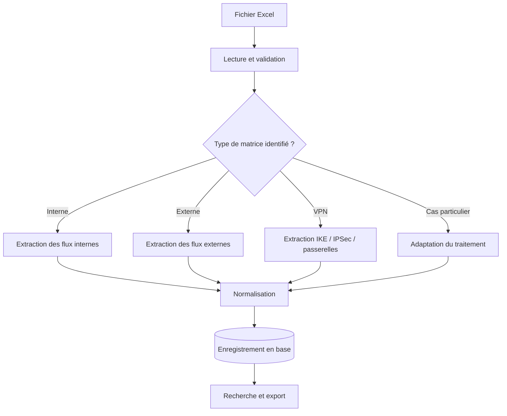
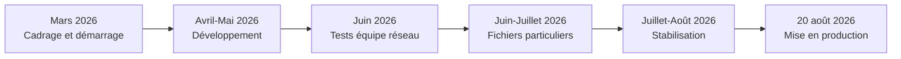

# Rapport de réalisation
## Application web RIPTIS
### Gestion centralisée des matrices de flux réseau

**Entreprise :** Transactis  
**Auteur :** TENEZEU VOUFO Benny Dieudonne  
**Maître d'apprentissage :** Pierre Jochum  
**Tuteur académique :** Roger GROULT - Icam  
**Période du projet :** mars 2026 - août 2026  
**Début des tests utilisateurs :** juin 2026  
**Mise en production officielle :** 20 août 2026  
**Version :** 1.0  
**Confidentialité :** document à usage interne Transactis

---

## Sommaire

1. Introduction  
2. Présentation du contexte  
3. Analyse de l'existant  
4. Problématique et objectifs  
5. Difficultés rencontrées  
6. Choix techniques et architecture  
7. Fonctionnalités développées  
8. Sécurité, sauvegarde et fiabilité  
9. Tests et validation  
10. Déploiement et mise en production  
11. Résultats obtenus  
12. Limites et perspectives  
13. Bilan personnel  
14. Conclusion

---

# 1. Introduction

Dans le cadre de mon projet réalisé au sein de Transactis, j'ai conçu et développé RIPTIS, une application web destinée à centraliser, organiser et exploiter les matrices de flux réseau.

Avant la mise en place de cette application, les informations réseau étaient principalement réparties dans un grand nombre de fichiers Excel. Cette organisation rendait les recherches longues, peu fiables et difficilement accessibles. RIPTIS a été développé afin de proposer un point d'accès unique aux données, de faciliter leur recherche et d'améliorer leur exploitation par l'équipe réseau.

Le projet a évolué progressivement depuis une première version orientée vers la consultation et la centralisation des matrices. De nouvelles fonctionnalités ont ensuite été ajoutées, notamment la recherche DNS, la gestion des dossiers, la gestion des utilisateurs et des permissions ainsi que des mécanismes de sauvegarde des données.

Ce rapport présente le contexte du projet, les difficultés rencontrées, les choix de conception, les fonctionnalités développées, la phase de validation et les perspectives d'évolution.

> **Illustration à insérer - Capture 1 : page d'accueil de RIPTIS**  
> Insérer une capture de la page d'accueil affichant les principaux accès fonctionnels de l'application. La capture doit être anonymisée et ne doit pas faire apparaître de données réseau sensibles.

**Figure 1 - Page d'accueil de l'application RIPTIS**

# 2. Présentation du contexte

## 2.1 L'environnement Transactis

Transactis évolue dans un environnement bancaire fortement sécurisé. Les applications et les données manipulées sont soumises à des contraintes importantes en matière d'accès, d'authentification, de confidentialité et d'exploitation.

Ces contraintes ont directement influencé le déroulement du projet. La mise en place de l'environnement de développement, l'obtention des droits nécessaires et l'accès aux ressources techniques ont constitué des étapes indispensables avant de pouvoir développer et tester l'application dans de bonnes conditions.

## 2.2 Le besoin métier

Les équipes réseau manipulent un volume important de données liées aux flux, aux adresses IP, aux ports, aux protocoles, aux équipements et aux informations VPN. Ces données étaient présentes dans de nombreux fichiers Excel, parfois anciens et construits selon des formats différents.

Le besoin principal était donc de rendre ces informations plus accessibles, sans remettre immédiatement en cause les fichiers historiques qui constituaient la source de données existante.

| Avant RIPTIS | Avec RIPTIS |
|---|---|
| Recherche manuelle dans 50 à 100 fichiers Excel | Recherche depuis une interface centralisée |
| Formats de fichiers hétérogènes | Import et analyse de plusieurs structures |
| Informations dispersées | Données regroupées dans une base PostgreSQL |
| Recherche dépendante de la connaissance des fichiers | Recherche par IP, port, protocole et mots-clés |
| Peu de visibilité sur l'ensemble des données | Organisation par dossiers, matrices et demandeurs |

**Tableau 1 - Comparaison entre l'organisation avant RIPTIS et la solution mise en place**

# 3. Analyse de l'existant

## 3.1 Fonctionnement avant RIPTIS

Avant RIPTIS, lorsqu'un utilisateur souhaitait rechercher un port ou une adresse IP, il devait parcourir manuellement entre 50 et 100 fichiers Excel. Avec un peu de chance, l'information pouvait être trouvée dans les premiers fichiers consultés. Dans le cas contraire, la recherche devenait particulièrement longue et incertaine.

Cette méthode présentait plusieurs limites :

- les fichiers étaient nombreux et dispersés ;
- les informations n'étaient pas regroupées dans une base commune ;
- les formats différaient d'un fichier à l'autre ;
- la recherche dépendait fortement de la connaissance des fichiers par l'utilisateur ;
- le temps nécessaire pour retrouver une information était difficile à prévoir ;
- les risques d'oubli ou d'erreur lors de la consultation manuelle étaient importants.

L'organisation générale des données n'était donc pas suffisamment accessible pour permettre une recherche rapide et systématique.

## 3.2 Limites des fichiers historiques

Certains fichiers utilisés comme sources étaient anciens, certains datant de 2003. Leur structure et leur contenu n'avaient pas été conçus pour être importés automatiquement dans une application moderne.

Les différences observées concernaient notamment les noms de colonnes, l'organisation des feuilles, la représentation des adresses IP, la présence de plusieurs lignes pour un même flux et les informations spécifiques aux matrices VPN.

# 4. Problématique et objectifs

## 4.1 Problématique

Comment centraliser et rendre rapidement exploitables des données réseau réparties dans plusieurs dizaines ou centaines de fichiers Excel hétérogènes, tout en respectant les contraintes de sécurité d'un environnement bancaire ?

## 4.2 Objectifs du projet

Les objectifs principaux étaient les suivants :

- centraliser les informations issues des matrices Excel ;
- permettre une recherche par adresse IP, port, protocole et mots-clés ;
- réduire le temps nécessaire pour retrouver une information ;
- organiser les matrices par dossiers et par demandeurs ;
- conserver les différents types de matrices, notamment internes, externes et VPN ;
- permettre l'import de fichiers Excel existants ;
- proposer un export des données ;
- gérer l'authentification et les permissions des utilisateurs ;
- assurer la sauvegarde régulière des données ;
- préparer l'intégration future d'outils réseau complémentaires.

| Objectif | Indicateur de réussite | État à documenter |
|---|---|---|
| Centraliser les matrices | Matrices importées dans la base | À compléter avec le volume réel |
| Accélérer la recherche | Temps moyen avant/après RIPTIS | À mesurer sur un échantillon |
| Gérer les formats historiques | Fichiers importés sans correction manuelle | À compléter après la campagne de tests |
| Sécuriser l'accès | Authentification et permissions actives | Mis en place |
| Préserver les données | Sauvegardes planifiées et vérifiées | À compléter avec la fréquence exacte |

**Tableau 2 - Objectifs et indicateurs de suivi**

# 5. Difficultés rencontrées

## 5.1 Contraintes d'accès et de sécurité

La première difficulté a été liée à mon arrivée récente dans le projet et à la nécessité d'obtenir de nombreuses autorisations pour pouvoir avancer. Dans un environnement bancaire fortement sécurisé, les accès aux serveurs, aux bases de données, aux outils de développement et aux environnements de déploiement sont contrôlés.

Cette situation a demandé de la patience, de la coordination avec les équipes concernées et une compréhension progressive des règles de sécurité de Transactis. Certaines étapes techniques ne pouvaient être réalisées qu'après validation ou ouverture de droits spécifiques.

## 5.2 Hétérogénéité des fichiers Excel

La principale difficulté technique concernait l'absence d'uniformité des fichiers Excel. Les fichiers ne comportaient pas systématiquement les mêmes feuilles, les mêmes colonnes ou la même organisation des données.

La situation était rendue plus complexe par la présence de fichiers anciens, dont certains dataient de 2003. Il n'était donc pas possible de se limiter à une lecture simple et identique pour tous les fichiers.

Le traitement devait être capable de reconnaître plusieurs structures et de prendre en compte des cas particuliers. Cette contrainte a conduit à développer une logique d'analyse et de classification des fichiers, ainsi qu'à prévoir des traitements spécifiques pour les matrices VPN et les différentes formes de flux.

> **Illustration à insérer - Capture 2 : exemples de fichiers Excel historiques**  
> Insérer une capture anonymisée montrant deux ou trois structures Excel différentes. L'objectif est de rendre visible l'hétérogénéité des sources, sans afficher d'adresse IP réelle.

**Figure 2 - Exemples de structures Excel prises en compte par l'import**

## 5.3 Cas particuliers identifiés pendant les tests

Lors de la phase de test menée avec un membre de l'équipe réseau, une vingtaine de fichiers particuliers ont été identifiés. Ces fichiers ne suivaient pas suffisamment les formats déjà pris en charge par l'application.

Ces tests ont permis de mettre en évidence des situations qui n'étaient pas visibles avec les premiers jeux de données. Le traitement des imports a donc été amélioré afin de prendre en compte ces cas supplémentaires et de se rapprocher des données réellement utilisées par l'équipe réseau.

# 6. Choix techniques et architecture

## 6.1 Choix de la stack

Les choix techniques réalisés personnellement concernent principalement la technologie frontend et la technologie backend :

- **frontend :** Next.js, React et TypeScript ;
- **backend :** Node.js, Express et TypeScript.

Les autres composants techniques, notamment la base de données et le système d'authentification, correspondent aux technologies et aux standards déjà utilisés dans l'environnement Transactis. Ce choix a permis de rester cohérent avec l'écosystème existant et de faciliter l'intégration de l'application dans l'infrastructure de l'entreprise.

## 6.2 Architecture générale

RIPTIS repose sur une architecture composée de plusieurs éléments :

- une interface web développée avec Next.js et React ;
- une API backend développée avec Express et TypeScript ;
- une base de données PostgreSQL manipulée avec Sequelize ;
- un système d'authentification OIDC ;
- des mécanismes d'import et d'export de fichiers Excel ;
- des composants de déploiement basés sur Docker, Jenkins et Kubernetes ;
- un système de sauvegarde régulière de la base de données.

Cette organisation sépare l'interface utilisateur, la logique métier, la persistance des données et les mécanismes d'exploitation.

**Figure 3 - Architecture générale de RIPTIS**

> **Illustration à insérer - Schéma 1 : architecture déployée**  
> Remplacer ou compléter le diagramme Mermaid par un schéma réalisé avec les conventions de l'entreprise. Faire apparaître les flux entre navigateur, frontend, backend, OIDC, PostgreSQL, stockage des sauvegardes et outils de déploiement.

## 6.3 Modèle de données

La base de données permet notamment de gérer :

- les utilisateurs ;
- les rôles et les permissions ;
- les dossiers ;
- les demandeurs ;
- les matrices ;
- les routes ;
- les propriétés associées aux routes ;
- les informations VPN ;
- les informations RSSI ;
- les invitations.

Une matrice peut être rattachée à un dossier, à un demandeur ou à une matrice parente. Les routes et leurs propriétés sont conservées de manière structurée afin de permettre les recherches et la consultation depuis l'application.

| Entité | Rôle dans l'application | Relations principales |
|---|---|---|
| Utilisateur | Identité et accès à l'application | Rôle, permissions, invitations |
| Dossier | Regroupement fonctionnel de matrices | Matrices, demandeur |
| Matrice | Ensemble de flux réseau versionné | Dossier, routes, matrice parente |
| Route | Flux réseau consultable | Matrice, propriétés |
| Propriété | Information complémentaire d'une route | Route, clé/valeur |
| Information VPN | Données propres aux flux VPN | Matrice ou route selon le cas |

**Tableau 3 - Principales entités du modèle de données**

> **Illustration à insérer - Schéma 2 : modèle de données simplifié**  
> Insérer un diagramme relationnel anonymisé présentant au minimum Utilisateur, Rôle, Dossier, Matrice, Route et Propriété.

# 7. Fonctionnalités développées

L'ensemble des fonctionnalités de RIPTIS a été développé dans le cadre du projet.

## 7.1 Gestion des dossiers et des matrices

L'application permet de regrouper les matrices dans des dossiers et de les associer à des demandeurs. Les matrices peuvent être consultées selon leur type et leur contexte.

Les types de matrices pris en charge comprennent notamment :

- les matrices internes ;
- les matrices externes ;
- les matrices VPN.

La gestion des versions et des statuts permet de mieux suivre l'évolution des matrices.

## 7.2 Import des fichiers Excel

L'import Excel constitue une fonctionnalité centrale de RIPTIS. L'application analyse les fichiers transmis, identifie leur structure et extrait les informations utiles.

Le traitement prend en compte plusieurs configurations de fichiers, notamment :

- les différentes feuilles de routes ;
- les informations VPN ;
- les sections IKE et IPSec ;
- les passerelles VPN ;
- les flux comportant plusieurs adresses IP ;
- les en-têtes et colonnes présentant des variations ;
- les fichiers internes et externes.

Cette fonctionnalité permet de transformer progressivement un ensemble de documents Excel hétérogènes en données consultables depuis une base centralisée.

**Figure 4 - Parcours général d'un import Excel**

> **Illustration à insérer - Capture 3 : écran d'import**  
> Insérer une capture de l'écran d'import montrant la sélection d'un fichier et le retour utilisateur après traitement. Masquer les noms de fichiers contenant des informations sensibles.

## 7.3 Recherche multicritère

La recherche permet de retrouver plus rapidement une information réseau à partir de critères tels que :

- une adresse IP ;
- un port ;
- un protocole ;
- un mot-clé ;
- une matrice ;
- un dossier ;
- un demandeur.

Cette recherche constitue la réponse principale au problème rencontré avant RIPTIS : l'utilisateur n'a plus besoin d'ouvrir successivement de nombreux fichiers Excel pour retrouver une information.

| Critère de recherche | Exemple de valeur à afficher | Résultat attendu |
|---|---|---|
| Adresse IP | `10.x.x.x` anonymisée | Routes utilisant l'adresse recherchée |
| Port | `443` | Flux associés au port |
| Protocole | `TCP` ou `UDP` | Routes filtrées par protocole |
| Mot-clé | Nom d'application anonymisé | Matrices ou routes correspondantes |
| Dossier | Dossier de démonstration | Matrices rattachées au dossier |

**Tableau 4 - Exemples de critères de recherche**

> **Illustration à insérer - Capture 4 : recherche multicritère**  
> Insérer une capture montrant une recherche par adresse IP ou par port, avec les résultats retournés. Remplacer les valeurs sensibles par des valeurs fictives ou floutées.

## 7.4 Recherche DNS

Une fonctionnalité de recherche DNS a également été ajoutée. Elle permet d'enrichir la consultation des données réseau et de rapprocher les informations issues des matrices avec les informations obtenues à partir du système de noms de domaine.

Cette fonctionnalité constitue le début de l'intégration d'outils réseau directement dans l'application.

> **Illustration à insérer - Capture 5 : recherche DNS**  
> Insérer une capture de l'écran DNS avec une requête de démonstration et son résultat anonymisé. Ajouter une courte légende expliquant l'intérêt de rapprocher le nom DNS et l'adresse IP.

## 7.5 Gestion des utilisateurs et des permissions

RIPTIS intègre une authentification adaptée à l'environnement de Transactis ainsi qu'un système de rôles et de permissions. Les droits peuvent être utilisés pour contrôler l'accès aux fonctionnalités de consultation, de création, de modification, de suppression et de téléchargement.

## 7.6 Export des données

Les informations peuvent être exportées au format Excel afin de conserver un usage compatible avec les habitudes de travail existantes et de permettre la transmission de résultats aux équipes concernées.

> **Illustration à insérer - Capture 6 : export d'une matrice**  
> Insérer une capture de l'action d'export, puis éventuellement un extrait anonymisé du fichier produit.

# 8. Sécurité, sauvegarde et fiabilité

## 8.1 Sécurité de l'application

L'application a été conçue pour fonctionner dans un environnement bancaire sécurisé. Les principaux éléments pris en compte sont :

- l'authentification des utilisateurs ;
- la gestion des rôles et des permissions ;
- la protection des routes backend ;
- la limitation des requêtes ;
- la sécurisation des en-têtes HTTP ;
- le contrôle des origines autorisées ;
- la journalisation des événements techniques ;
- la séparation des environnements de développement, de recette et de production.

Les données et les informations d'accès doivent être manipulées conformément aux règles de sécurité de Transactis. Les secrets ne doivent pas être intégrés dans le code source et doivent être gérés par les mécanismes prévus dans l'infrastructure de l'entreprise.

## 8.2 Sauvegarde régulière des données

Un mécanisme de sauvegarde a été mis en place afin de sauvegarder régulièrement les données de l'application. Cette sauvegarde constitue une mesure importante de continuité et de fiabilité.

Elle permet de disposer d'une copie des données en cas de problème technique, d'erreur de manipulation, de corruption de la base ou d'incident affectant l'application. Les sauvegardes sont générées à partir de la base PostgreSQL et peuvent être stockées dans l'espace prévu par l'infrastructure, notamment via le stockage objet utilisé par l'application.

La sauvegarde ne remplace pas les contrôles de sécurité ni les procédures de restauration. Elle doit être accompagnée d'une vérification régulière de la disponibilité des fichiers produits et, lorsque cela est possible, de tests de restauration.

| Élément | Description à documenter |
|---|---|
| Déclenchement | Fréquence de la sauvegarde automatique |
| Source | Base PostgreSQL de RIPTIS |
| Destination | Stockage interne ou stockage objet sécurisé |
| Conservation | Durée et nombre de versions conservées |
| Contrôle | Vérification de la présence et de l'intégrité des fichiers |
| Restauration | Procédure et fréquence des tests de restauration |

**Tableau 5 - Politique de sauvegarde à préciser dans la version finale**

> **Illustration à insérer - Schéma 3 : cycle de sauvegarde**  
> Représenter le déclenchement périodique, l'exécution de la sauvegarde, le stockage sécurisé, la vérification et la restauration éventuelle.

## 8.3 Fiabilité et continuité

La centralisation des données réduit la dépendance à la consultation manuelle de fichiers dispersés. La base de données, les journaux applicatifs, les mécanismes de sauvegarde et les environnements de déploiement contribuent à rendre l'application plus fiable et plus exploitable dans la durée.

# 9. Tests et validation

## 9.1 Phase de test

La phase de test a commencé en juin 2026 avec la participation d'un membre de l'équipe réseau. Cette validation en conditions proches de l'utilisation réelle a permis de confronter l'application aux fichiers et aux habitudes de recherche de l'équipe.

Les tests ont porté notamment sur :

- l'import de matrices ;
- la prise en compte des différents formats Excel ;
- la recherche d'adresses IP et de ports ;
- la consultation des matrices ;
- la recherche DNS ;
- la gestion des cas particuliers.

## 9.2 Corrections issues des tests

La phase de test a permis d'identifier une vingtaine de fichiers particuliers. Leur analyse a conduit à adapter le traitement d'import pour tenir compte de formats qui n'étaient pas représentés dans les premiers fichiers utilisés pendant le développement.

Cette étape a été essentielle, car elle a permis de valider l'application sur des données effectivement rencontrées par l'équipe réseau et non uniquement sur des exemples préparés à l'avance.

| Domaine testé | Résultat ou observation |
|---|---|
| Import des fichiers standards | Fonctionnement à confirmer avec les jeux de données validés |
| Import des fichiers particuliers | Une vingtaine de fichiers ont nécessité une prise en compte spécifique |
| Recherche IP et port | Fonctionnalité validée pendant les essais utilisateurs |
| Recherche DNS | Fonctionnalité testée et poursuivie comme axe d'évolution |
| Export | Résultat à illustrer avec un fichier anonymisé |
| Permissions | Vérification à documenter par profil utilisateur |

**Tableau 6 - Synthèse de la campagne de validation**

> **Graphique à produire - Graphique 1 : temps de recherche avant/après RIPTIS**  
> Mesurer plusieurs recherches comparables avant et après RIPTIS, puis représenter les temps moyens dans un histogramme. Ne pas inventer les valeurs : renseigner le graphique après collecte des mesures.

> **Graphique à produire - Graphique 2 : répartition des fichiers importés par type**  
> Représenter le nombre de fichiers internes, externes, VPN et fichiers particuliers pris en compte pendant la campagne de test.

# 10. Déploiement et mise en production

Le projet a été développé puis déployé dans les environnements prévus par Transactis. L'infrastructure s'appuie notamment sur Docker pour la construction des applications, Jenkins pour l'automatisation des pipelines et Kubernetes pour le déploiement des composants.

L'application a été officiellement mise en production le **20 août 2026**. Cette mise en production marque le passage d'un outil en développement à une application utilisable dans le cadre opérationnel de l'équipe réseau.

**Figure 5 - Chronologie du projet**

> **Illustration à insérer - Capture 7 : application en environnement de production**  
> Insérer une capture de l'application déployée, sans URL interne, adresse IP, nom d'utilisateur ou donnée métier sensible.

# 11. Résultats obtenus

## 11.1 Amélioration de la recherche

Le principal résultat est la réduction de la dépendance à la recherche manuelle dans les fichiers Excel. Au lieu de parcourir successivement 50 à 100 documents, l'utilisateur dispose d'une interface centralisée permettant d'effectuer une recherche selon différents critères.

La recherche est ainsi plus rapide, plus accessible et plus homogène entre les utilisateurs. Elle limite également le risque de ne consulter qu'une partie des fichiers disponibles.

Pour quantifier ce gain, il est nécessaire de comparer une recherche équivalente avant et après RIPTIS. En l'absence de chronométrage systématique réalisé avant le projet, les valeurs ci-dessous constituent une estimation de travail et non une mesure expérimentale définitive.

| Indicateur | Avant RIPTIS | Avec RIPTIS | Estimation du gain |
|---|---:|---:|---:|
| Temps moyen pour retrouver une information | 15 min | 30 s | 14 min 30 s économisées |
| Temps de recherche restant | 100 % | 3,3 % | **-96,7 %** |
| Recherches traitées en une heure | 4 | 120 | capacité théorique multipliée par 30 |
| Risque de recherche incomplète | Élevé | Réduit par l'indexation centralisée | amélioration qualitative à confirmer |

**Tableau 8 - Estimation du gain de temps par recherche**

L'estimation repose sur une recherche manuelle moyenne de 15 minutes dans les fichiers historiques et une recherche RIPTIS d'environ 30 secondes. Le temps après RIPTIS comprend la saisie des critères, l'affichage des résultats et leur lecture. Ces deux valeurs devront être remplacées par la moyenne d'un échantillon chronométré en conditions réelles.

Le gain de temps estimé est calculé ainsi :

$$
	ext{Gain relatif} = \frac{15 - 0{,}5}{15} \times 100 = 96{,}7\,\%
$$

Le terme « quasiment instantanée » doit donc être compris comme une recherche qui passe de plusieurs minutes à quelques secondes, et non comme une absence totale de délai.

> **Graphique à produire - Graphique 3 : temps moyen d'une recherche**  
> Créer un histogramme comparant le temps moyen avant RIPTIS et avec RIPTIS. Afficher les valeurs en minutes et indiquer clairement qu'il s'agit d'une estimation tant que les chronométrages réels ne sont pas disponibles.

## 11.2 Centralisation et organisation

Les données sont regroupées dans une base structurée et peuvent être classées par dossier, demandeur, type de matrice et version. Cette organisation facilite la consultation et améliore la compréhension de l'ensemble des informations disponibles.

La centralisation produit également un gain de capacité opérationnelle. Une recherche qui mobilisait auparavant un utilisateur pendant 15 minutes peut être réalisée en environ 30 secondes. D'après le rythme d'utilisation envisagé, l'hypothèse retenue est de deux recherches par jour ouvré, auxquelles s'ajoutent deux à trois recherches supplémentaires par semaine. Cela représente environ 12 à 13 recherches par semaine.

$$
\left((2 \times 5) + 2{,}5\right) \times (15 - 0{,}5) = 181{,}25\ \text{minutes par semaine}
$$

Cela correspond à environ **3 heures de temps économisé par semaine**, soit environ **157 heures par an** sur 52 semaines. Cette estimation ne signifie pas que ce temps sera automatiquement supprimé du temps de travail : il peut être réaffecté à l'analyse réseau, à la résolution d'incidents ou à d'autres tâches à valeur ajoutée.

## 11.3 Estimation du gain financier

Le gain financier dépend du nombre réel de recherches, du nombre de personnes concernées et du coût horaire chargé retenu par Transactis. Pour donner un ordre de grandeur, le scénario ci-dessous utilise l'hypothèse réaliste de **2 recherches par jour ouvré**, plus **2 à 3 recherches supplémentaires par semaine**, soit **12 à 13 recherches par semaine**, ainsi qu'un coût horaire chargé estimatif de **50 euros**.

| Hypothèse | Volume hebdomadaire | Temps économisé par semaine | Temps économisé par an | Valeur annuelle estimée à 50 €/h |
|---|---:|---:|---:|---:|
| Bas | 12 recherches | 174 min, soit 2 h 54 | 150,8 h | 7 542 € |
| Réaliste | 12,5 recherches | 181 min, soit 3 h 01 | **156,9 h** | **7 846 €** |
| Haut | 13 recherches | 188,5 min, soit 3 h 09 | 163,4 h | 8 171 € |
| Bas | 12 recherches | 174 min, soit 2 h 54 | 150,8 h | 7 540 € |
| Réaliste | 12,5 recherches | 181,25 min, soit 3 h 01 | **157,1 h** | **7 854 €** |
| Haut | 13 recherches | 188,5 min, soit 3 h 09 | 163,4 h | 8 168 € |

**Tableau 9 - Estimation de la valeur du temps libéré selon le rythme réel d'utilisation**

Dans le scénario central, le calcul est le suivant :

$$
	ext{Valeur annuelle} = 12{,}5 \times 14{,}5\ \text{min} \times 52 \times \frac{50}{60}
= 7\,854{,}17\ €
$$

Ce montant représente la **valeur du temps de travail libéré pour un utilisateur**, et non une économie comptable automatique. L'économie réellement constatée dépendra de la capacité de l'entreprise à réaffecter ce temps à des activités productives. Le rapport final devra remplacer le coût horaire de 50 euros par le coût chargé validé par Transactis et préciser le nombre réel d'utilisateurs concernés.

Si plusieurs utilisateurs réalisent ces recherches, le résultat doit être multiplié par le nombre d'utilisateurs actifs, en évitant de compter deux fois une même recherche collaborative. Le retour sur investissement pourra ensuite être estimé avec la formule suivante :

$$
	ext{ROI} = \frac{\text{valeur annuelle du temps gagné} - \text{coût annuel de fonctionnement}}{\text{coût du projet et de fonctionnement}} \times 100
$$

> **Graphique à produire - Graphique 4 : valeur annuelle selon le volume de recherches**  
> Représenter les scénarios prudent, central et haut sous forme d'histogramme. Ajouter une note indiquant que les montants sont des estimations et qu'ils doivent être recalculés avec le coût horaire réel.

## 11.4 Évolution de l'outil

RIPTIS ne se limite plus à une simple centralisation de fichiers. L'application propose désormais plusieurs services complémentaires, comme la recherche DNS, la gestion des utilisateurs et des permissions, l'import de formats variés, l'export et la sauvegarde régulière des données.

# 12. Limites et perspectives

## 12.1 Limites actuelles

La diversité des fichiers historiques constitue encore une limite. Même si de nombreux formats sont pris en charge, certains fichiers peuvent nécessiter une analyse ou une adaptation spécifique.

La qualité des résultats dépend également de la qualité des données sources et de la mise à jour des matrices importées.

## 12.2 Évolutions prévues

Plusieurs évolutions sont envisagées ou déjà commencées :

- intégrer davantage de commandes et d'outils réseau ;
- poursuivre l'intégration de fonctions de type DNS lookup ;
- référencer d'autres sources externes afin d'affiner les recherches ;
- créer des tableaux de bord Grafana personnalisés ;
- produire des statistiques sur la masse de données disponible dans la base ;
- répondre à de nouvelles demandes formulées par l'équipe réseau ;
- améliorer progressivement la prise en charge des fichiers Excel particuliers ;
- renforcer les procédures de suivi et de restauration des sauvegardes.

Les tableaux de bord permettront notamment de mieux exploiter la dimension quantitative des données centralisées et de faire apparaître des tendances utiles à l'équipe réseau.

# 13. Bilan personnel

Ce projet m'a permis de prendre en charge le développement complet d'une application, du besoin initial jusqu'à la mise en production. J'ai travaillé sur le frontend, le backend, l'import de données, la recherche, la gestion des utilisateurs, les tests et le déploiement.

La principale difficulté a été de progresser dans un environnement bancaire sécurisé nécessitant de nombreuses autorisations. Le traitement de fichiers Excel anciens et hétérogènes m'a également obligé à concevoir une solution suffisamment souple pour gérer des cas réels et imprévus.

La phase de test avec l'équipe réseau a été particulièrement importante. Elle m'a permis de confronter mes choix à des usages concrets, d'identifier les fichiers particuliers et d'améliorer l'application avant sa mise en production.

# 14. Conclusion

RIPTIS répond à un besoin concret de centralisation et de recherche des informations réseau. Avant le projet, retrouver un port ou une adresse IP pouvait nécessiter la consultation manuelle de 50 à 100 fichiers Excel. L'application apporte désormais une base commune, une recherche multicritère, une organisation par dossiers, une recherche DNS, des contrôles d'accès et une sauvegarde régulière des données.

Le projet a été officiellement mis en production le 20 août 2026 après une phase de test commencée en juin avec l'équipe réseau. Malgré les contraintes d'accès et l'hétérogénéité des fichiers historiques, l'application a pu évoluer pour prendre en compte les cas particuliers rencontrés.

Les prochaines évolutions permettront d'étendre RIPTIS vers un véritable outil d'aide à l'exploitation réseau, grâce à l'intégration de sources externes, d'outils réseau et de tableaux de bord personnalisés.

| Évolution | Valeur attendue | Avancement |
|---|---|---|
| Outils réseau et commandes | Réduire les changements d'outil pendant l'analyse | Déjà commencé avec DNS lookup |
| Sources externes | Enrichir et recouper les résultats | Prévu |
| Tableaux de bord Grafana | Visualiser les statistiques de la base | Prévu / à personnaliser |
| Demandes de l'équipe réseau | Adapter l'outil aux besoins opérationnels | Continu |

**Tableau 7 - Feuille de route des évolutions**

> **Illustration à insérer - Maquette 1 : tableau de bord Grafana**  
> Insérer une maquette ou une capture d'un tableau de bord présentant des indicateurs anonymisés : nombre de matrices, nombre de routes, répartition par type, évolution des imports et qualité des données.
